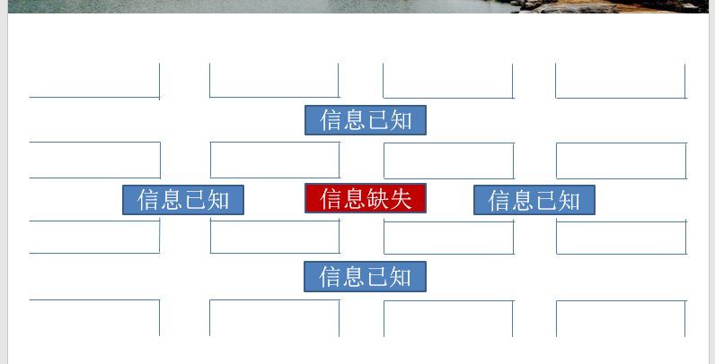
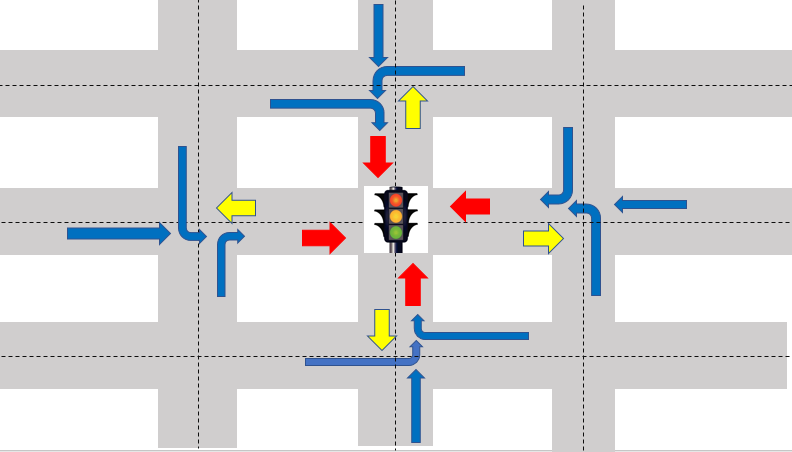
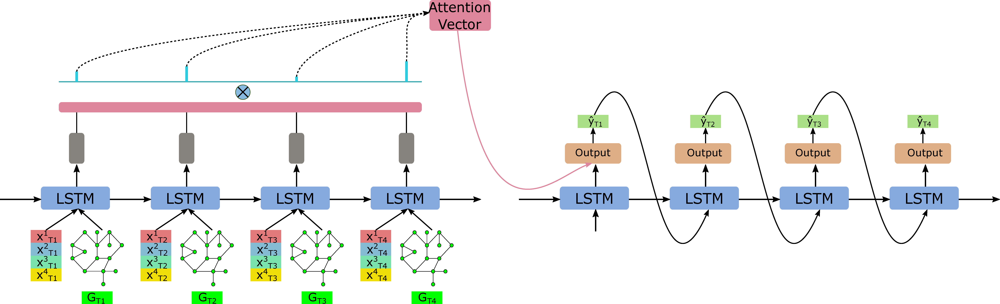

# Traffic_Prediction
 Exchange_Idea_Code_Paper

 ***

 用已知口的{t1,..., ，tn}预测未知口的{t1,..., ，tn}

***

基本思路

Encoder-Decoder 架构, 初步设计

1. Encoder 

    * Graph NN 提取t时刻空间关系，
    * LSTM 处理t1-tn

2. Decoder

    * LSTM 多步预测
    * Attention 提供解释性

从这个模式开始改进

***

相关资料

- [ ] [Graph2Seq](https://github.com/nwpuhq/Graph2Seq) 这个本科毕设值得看一看，简单紧凑。只用Graph NN做Encoder不适合我们这个问题，但是扩展很容易。 

